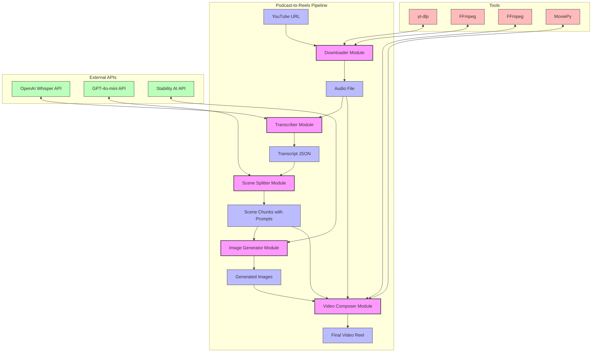

# Architecture Diagram

This diagram illustrates how the major modules interact.  For a textual explanation, see the [Modules Overview](modules_overview.md) and the [README](../README.md).

```mermaid
graph TD
    subgraph "Podcast-to-Reels Pipeline"
        A[YouTube URL] --> B[Downloader Module]
        B --> C[Audio File]
        C --> D[Transcriber Module]
        D --> E[Transcript JSON]
        E --> F[Scene Splitter Module]
        F --> G[Scene Chunks with Prompts]
        G --> H[Image Generator Module]
        H --> I[Generated Images]
        C --> J[Video Composer Module]
        G --> J
        I --> J
        J --> K[Final Video Reel]
    end

    subgraph "External APIs"
        API1[OpenAI Whisper API] <--> D
        API2[GPT-4o-mini API] <--> F
        API3[Stability AI API] <--> H
    end

    subgraph "Tools"
        T1[yt-dlp] <--> B
        T2[FFmpeg] <--> B
        T3[FFmpeg] <--> J
        T4[MoviePy] <--> J
    end

    classDef module fill:#f9f,stroke:#333,stroke-width:2px;
    classDef data fill:#bbf,stroke:#333,stroke-width:1px;
    classDef api fill:#bfb,stroke:#333,stroke-width:1px;
    classDef tool fill:#fbb,stroke:#333,stroke-width:1px;
    
    class B,D,F,H,J module;
    class A,C,E,G,I,K data;
    class API1,API2,API3 api;
    class T1,T2,T3,T4 tool;
```
