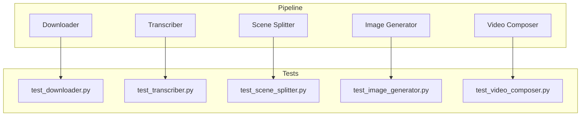

# Modules Overview

This document describes each pipeline component and cross-references the source code and unit tests.

## Pipeline Modules

1. **Downloader**
   - Source: [`podcast_to_reels/downloader/downloader.py`](../podcast_to_reels/downloader/downloader.py)
   - Tests: [`tests/test_downloader.py`](../tests/test_downloader.py)
   - Responsible for fetching audio from a YouTube URL using `yt-dlp` and trimming long videos with FFmpeg.

2. **Transcriber**
   - Source: [`podcast_to_reels/transcriber/transcriber.py`](../podcast_to_reels/transcriber/transcriber.py)
   - Tests: [`tests/test_transcriber.py`](../tests/test_transcriber.py)
   - Uses the OpenAI Whisper API to convert audio to text.

3. **Scene Splitter**
   - Source: [`podcast_to_reels/scene_splitter/scene_splitter.py`](../podcast_to_reels/scene_splitter/scene_splitter.py)
   - Tests: [`tests/test_scene_splitter.py`](../tests/test_scene_splitter.py)
   - Breaks the transcript into scenes and generates image prompts using GPT‑4o-mini.

4. **Image Generator**
   - Source: [`podcast_to_reels/image_generator/image_generator.py`](../podcast_to_reels/image_generator/image_generator.py)
   - Tests: [`tests/test_image_generator.py`](../tests/test_image_generator.py)
   - Calls the Stability AI API to turn prompts into images.

5. **Video Composer**
   - Source: [`podcast_to_reels/video_composer/video_composer.py`](../podcast_to_reels/video_composer/video_composer.py)
   - Tests: [`tests/test_video_composer.py`](../tests/test_video_composer.py)
   - Combines the generated images and audio clips into a final MP4 video.

## Module/Test Relationships

Refer back to the [README](../README.md) for installation and usage instructions.
